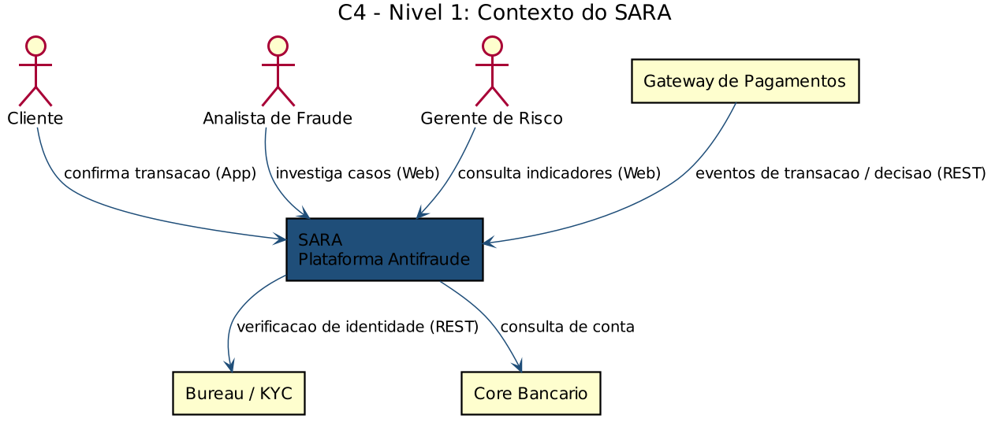
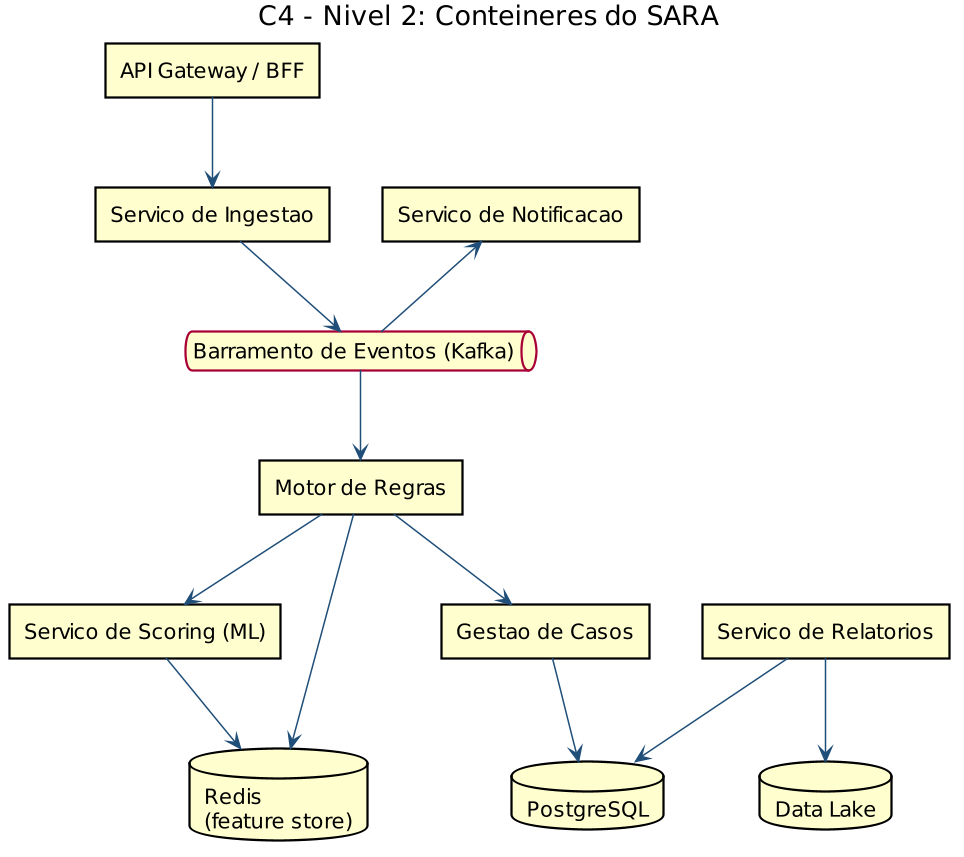
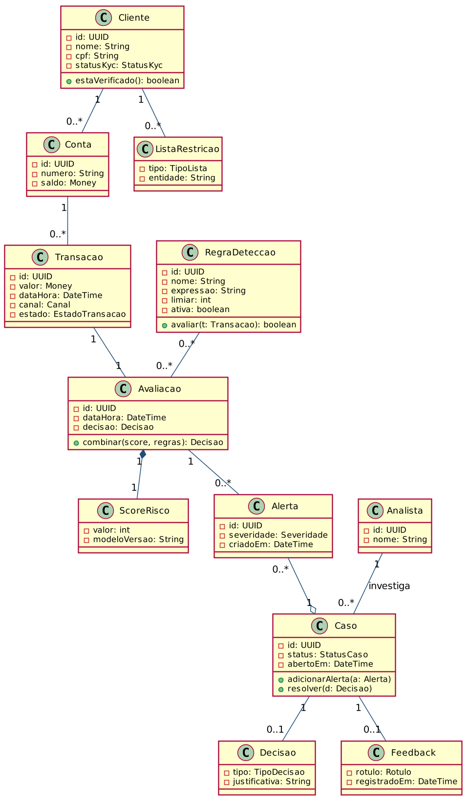
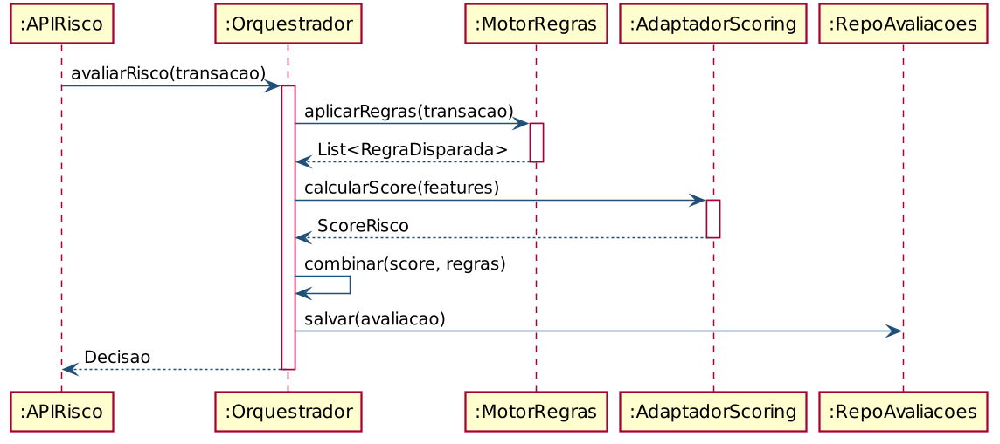
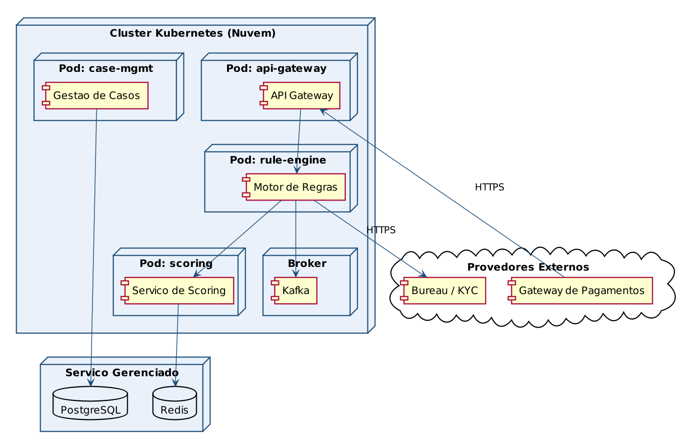
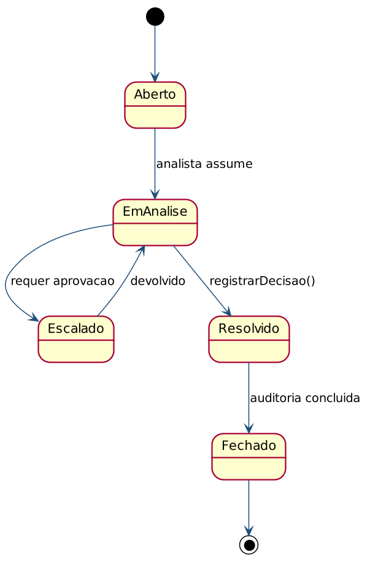

<a href="https://classroom.github.com/online_ide?assignment_repo_id=99999999&assignment_repo_type=AssignmentRepo"></a> <a href="https://classroom.github.com/open-in-codespaces?assignment_repo_id=99999999"></a>

---

# 🛡️ SARA — Sistema de Análise de Risco e Antifraude 👨‍💻

> [!NOTE]
> Plataforma de **análise de risco e antifraude para fintechs** que avalia, em tempo real, o risco de fraude em transações financeiras (PIX, cartão, transferências e crédito), combinando um **motor de regras** configurável com um **serviço de scoring baseado em aprendizado de máquina**. **Principal valor: reduzir perdas por fraude sem sacrificar a experiência do cliente.**

<table>
  <tr>
    <td width="800px">
      <div align="justify">
        O <b>SARA</b> é uma plataforma de apoio à operação de fintechs cujo objetivo é proteger clientes e instituição contra fraudes transacionais. O sistema ingere eventos de transação de forma assíncrona, enriquece cada operação com o histórico do cliente, aplica regras de detecção e solicita um <i>score de risco</i> a um modelo de aprendizado de máquina, devolvendo ao canal de origem uma decisão de <b>APROVAR</b>, <b>NEGAR</b> ou <b>REVISAR</b>. Casos suspeitos são encaminhados para uma esteira de investigação, onde analistas de fraude conduzem a análise e registram o desfecho, que realimenta o modelo. O projeto busca equilibrar <b>segurança</b> e <b>baixa fricção</b>, minimizando tanto a perda financeira por fraude quanto a taxa de falsos positivos. Este repositório foi desenvolvido como parte da disciplina <i>Projeto de Software</i> do curso de Engenharia de Software da PUC Minas.
      </div>
    </td>
    <td>
      <div>
        
      </div>
    </td>
  </tr> 
</table>

---

## 🚧 Status do Projeto


          

---

## 📚 Índice
- [Links Úteis](#-links-úteis)
- [Sobre o Projeto](#-sobre-o-projeto)
- [Funcionalidades Principais](#-funcionalidades-principais)
- [Tecnologias Utilizadas](#-tecnologias-utilizadas)
- [Arquitetura](#-arquitetura)
  - [Exemplos de diagramas](#exemplos-de-diagramas)
- [Instalação e Execução](#-instalação-e-execução)
  - [Pré-requisitos](#pré-requisitos)
  - [Variáveis de Ambiente](#-variáveis-de-ambiente)
  - [Instalação de Dependências](#-instalação-de-dependências)
  - [Inicialização do Banco de Dados (PostgreSQL)](#-inicialização-do-banco-de-dados-postgresql)
  - [Como Executar a Aplicação](#-como-executar-a-aplicação)
- [Deploy](#-deploy)
- [Estrutura de Pastas](#-estrutura-de-pastas)
- [Demonstração](#-demonstração)
- [Testes](#-testes)
- [Documentações utilizadas](#-documentações-utilizadas)
- [Autores](#-autores)
- [Contribuição](#-contribuição)
- [Agradecimentos](#-agradecimentos)
- [Licença](#-licença)

---

## 🔗 Links Úteis
* 🌐 **Demo Online:** [Acesse a Aplicação Web](<link-da-demo-web>)
  > 💻 **Descrição:** Painel web do analista/gestor de risco em ambiente de produção (ex.: Vercel ou AWS).
* 📖 **Documentação da API:** [Swagger / OpenAPI](http://localhost:8080/swagger-ui.html)
  > 📚 **Descrição:** Documentação interativa dos endpoints REST do motor de avaliação de risco.
* 📐 **Documentação de Projeto (UML):** [SARA — Documentação de Projeto.docx](./SARA%20-%20Documenta%C3%A7%C3%A3o%20de%20Projeto.docx)
  > 🧩 **Descrição:** Modelos de domínio e de projeto (casos de uso, classes, sequência, estados e dados).

---

## 📝 Sobre o Projeto

O **SARA** nasceu da necessidade das fintechs de combater fraudes transacionais sem comprometer a experiência do cliente. À medida que meios de pagamento instantâneos (como o PIX) se popularizam, cresce também a sofisticação dos golpes — e regras estáticas, isoladamente, tornam-se insuficientes.

- **Por que ele existe:** automatizar a decisão de risco em tempo real e estruturar a investigação de casos suspeitos, hoje frequentemente manual e reativa.
- **Qual problema ele resolve:** o compromisso entre **segurança** e **fricção**. Regras muito restritivas geram falsos positivos (clientes legítimos bloqueados); regras frouxas elevam a perda por fraude. O SARA otimiza esse equilíbrio combinando regras e scoring de ML, com realimentação contínua das decisões dos analistas.
- **Qual o contexto:** acadêmico — disciplina **Projeto de Software** (Engenharia de Software, PUC Minas) —, com modelagem aplicável a cenários reais de mercado.
- **Onde pode ser utilizado:** fintechs, instituições de pagamento, carteiras digitais e adquirentes que precisem avaliar risco de transações e gerir alertas de fraude.

O valor entregue é a redução das perdas financeiras por fraude, o aumento da taxa de aprovação de transações legítimas e a rastreabilidade/auditoria de cada decisão.

> [!NOTE]
> Esta seção segue boas práticas de documentação profissional e foi ajustada ao domínio de antifraude em fintechs.

---

## ✨ Funcionalidades Principais

- 🧮 **Avaliação de Risco em Tempo Real:** scoring de cada transação combinando motor de regras e modelo de ML, com decisão APROVAR / NEGAR / REVISAR.
- 🚨 **Geração de Alertas:** criação automática de alertas quando o score ultrapassa o limiar configurado.
- 🗂️ **Gestão de Casos:** esteira de investigação para os analistas, agrupando alertas e registrando o desfecho.
- ⚙️ **Motor de Regras Configurável:** criação, edição e ativação de regras e limiares pelo administrador.
- 🪪 **Verificação KYC (Onboarding):** validação de identidade do cliente via bureau externo.
- 🚫 **Listas de Restrição:** gestão de blocklist e allowlist (CPF, cartão, dispositivo, IP).
- 📊 **Relatórios e Indicadores:** painéis de fraude, perdas evitadas, falsos positivos e desempenho do modelo.
- 🔄 **Feedback para o Modelo:** decisões dos analistas realimentam o re-treinamento do scoring.
- 📨 **Sistema de Notificações:** alerta o cliente e solicita confirmação de transações suspeitas (e-mail/push).
- 🔐 **Autenticação Segura:** login com JWT e controle de acesso por perfil (analista, gestor, administrador).

---

## 🛠 Tecnologias Utilizadas

As seguintes ferramentas, frameworks e bibliotecas foram utilizados na construção deste projeto. Recomenda-se o uso das versões listadas (ou superiores) para garantir a compatibilidade.

### 💻 Front-end

* **Framework/Biblioteca:** React v19
* **Linguagem/Superset:** TypeScript (ES6+)
* **Estilização:** Tailwind CSS
* **Gerenciamento de Estado:** Context API + React Query
* **Build Tool:** Vite v7

### 🖥️ Back-end

* **Linguagem/Runtime:** Java 17 (JDK)
* **Framework:** Spring Boot 3.3.x (Spring Web, Spring Data JPA)
* **Banco de Dados:** PostgreSQL 16
* **Cache / Feature Store:** Redis 7
* **Mensageria / Eventos:** Apache Kafka 3.7
* **ORM / Query Builder:** Hibernate / JPA
* **Autenticação:** JWT + Spring Security

### 🤖 Serviço de Scoring (ML)

* **Linguagem:** Python 3.11
* **Framework:** FastAPI
* **Bibliotecas:** scikit-learn / XGBoost
* **Comunicação:** REST/gRPC consumido pelo Motor de Regras

### ⚙️ Infraestrutura & DevOps

* **Containerização:** Docker, Docker Compose
* **Orquestração:** Kubernetes (K8s)
* **Cloud:** AWS (EKS, RDS, ElastiCache) / Vercel (front-end)
* **CI/CD:** GitHub Actions

---

## 🏗 Arquitetura

O SARA adota uma arquitetura de **microsserviços orientados a eventos**. A ingestão de transações é assíncrona, através de um barramento **Apache Kafka**, enquanto a avaliação de risco expõe uma **API síncrona de baixa latência** consumida pelo Gateway de Pagamentos. Essa escolha permite **escalar a ingestão** independentemente da avaliação, **absorver picos** de transação e **desacoplar** os serviços de notificação e relatório do caminho crítico da decisão.

**Principais componentes:**

- **API Gateway / BFF** — ponto de entrada, autenticação (JWT) e roteamento.
- **Serviço de Ingestão** — recebe os eventos de transação e publica no Kafka.
- **Motor de Regras** — aplica as regras de detecção e orquestra a decisão.
- **Serviço de Scoring (ML)** — calcula a probabilidade de fraude a partir das features.
- **Gestão de Casos** — esteira de investigação dos analistas.
- **Serviço de Notificação** — comunica clientes sobre transações suspeitas.
- **Serviço de Relatórios** — indicadores e painéis gerenciais.

**Padrões de design adotados:** Repository, Service Layer, DTOs, Adapter (para regras e scoring), Strategy (combinação regras × score) e Observer/Event-Driven (via Kafka).

**Fluxo de dados:** `Gateway → API → Ingestão → Kafka → Motor de Regras → (Scoring + Redis) → Decisão → Gestão de Casos / Notificação`. Os eventos brutos e os rótulos das decisões são persistidos em um **data lake** (Parquet) para re-treinamento e auditoria.

**Trade-offs:** a arquitetura orientada a eventos adiciona complexidade operacional (broker, observabilidade, consistência eventual) em troca de escalabilidade e resiliência. Em caso de indisponibilidade do serviço de ML, o sistema opera em **modo degradado**, decidindo apenas pelas regras.

### Exemplos de diagramas

Os diagramas completos (UML/C4) estão na [Documentação de Projeto](./SARA%20-%20Documenta%C3%A7%C3%A3o%20de%20Projeto.docx). Visão organizada lado a lado:

| Diagrama de Arquitetura | Detalhe da Arquitetura |
| :---: | :---: |
| **Visão Geral (C4 — Contexto)** | **Contêineres (C4 — Nível 2)** |
|  |  |
| **Modelo de Domínio (Classes)** | **Fluxo de Avaliação de Risco (Sequência)** |
|  |  |
| **Infraestrutura (Cloud/K8s)** | **Máquina de Estados do Caso** |
|  |  |

> 🖼️ Os diagramas acima são gerados em PlantUML e versionados em [`/docs/diagramas`](./docs/diagramas). O diagrama de casos de uso completo está em [`casos_uso.png`](./docs/diagramas/casos_uso.png), e os demais (SSDs, componentes, comunicação, estados da transação) estão na [Documentação de Projeto](./SARA%20-%20Documenta%C3%A7%C3%A3o%20de%20Projeto.docx).

---

## 🔧 Instalação e Execução

### Pré-requisitos

* **Java JDK:** Versão **17** ou superior (Back-end Spring Boot)
* **Node.js:** Versão LTS (v18.x ou superior) (Front-end React)
* **Gerenciador de Pacotes:** npm ou yarn
* **Docker** (Opcional, mas **altamente recomendado** para PostgreSQL, Redis e Kafka)

---

### 🔑 Variáveis de Ambiente

#### 1. Back-end (Spring Boot)

| Variável | Descrição | Exemplo |
| :--- | :--- | :--- |
| `SERVER_PORT` | Porta onde o Back-end será executado. | `8080` |
| `SPRING_DATASOURCE_URL` | URL de conexão JDBC (PostgreSQL). | `jdbc:postgresql://localhost:5432/sara` |
| `SPRING_DATASOURCE_USERNAME` | Usuário do banco de dados. | `postgres` |
| `SPRING_DATASOURCE_PASSWORD` | Senha do banco de dados. | `senha-segura-123` |
| `SPRING_KAFKA_BOOTSTRAP_SERVERS` | Endereço do broker Kafka. | `localhost:9092` |
| `SPRING_REDIS_HOST` | Host do Redis (feature store). | `localhost` |
| `SCORING_SERVICE_URL` | URL do serviço de scoring (ML). | `http://localhost:8000/score` |
| `JWT_SECRET` | Chave secreta para assinatura de tokens. | `chave_super_segura_base64` |

#### 2. Front-end (React, Vite)

Crie um arquivo **`.env`** na raiz de `/frontend` usando o prefixo `VITE_`.

| Variável | Descrição | Exemplo |
| :--- | :--- | :--- |
| `VITE_API_URL` | URL base do Back-end Spring Boot. | `http://localhost:8080/api` |
| `VITE_APP_NAME` | Nome exibido na aplicação. | `SARA` |

> **Obs:** As variáveis em projetos **Vite** precisam começar com `VITE_` para serem incluídas no *bundle* do front-end.

Exemplo de `frontend/.env.local`:

```
VITE_API_URL=http://localhost:8080/api
VITE_APP_NAME=SARA
```

---

### 📦 Instalação de Dependências

1. **Clone o Repositório:**

```bash
git clone <URL_DO_SEU_REPOSITÓRIO>
cd sara
```

#### Front-end (React)

```bash
cd frontend
npm install
# ou
yarn install
cd ..
```

#### Back-end (Spring Boot)

```bash
cd backend
./mvnw clean install
cd ..
```

---

### 💾 Inicialização do Banco de Dados (PostgreSQL)

A forma mais fácil de inicializar o banco é via Docker:

```bash
docker run --name sara_db -e POSTGRES_USER=postgres -e POSTGRES_PASSWORD=senha-segura-123 -e POSTGRES_DB=sara -p 5432:5432 -d postgres:16
```

As migrações de schema são gerenciadas pelo **Spring Boot** no startup (Hibernate `ddl-auto`) ou via **Flyway**:

```bash
cd backend
./mvnw flyway:migrate
```

---

### ⚡ Como Executar a Aplicação

Execute em **dois terminais separados**.

#### Terminal 1: Back-end (Spring Boot)

```bash
cd backend
./mvnw spring-boot:run
```
🚀 *O Back-end estará disponível em **http://localhost:8080**.*

#### Terminal 2: Front-end (React, Vite)

```bash
cd frontend
npm run dev
```
🎨 *O Front-end estará disponível em **http://localhost:5173**.*

#### 🐳 Execução Local Completa com Docker Compose

Sobe Back-end, Front-end, PostgreSQL, Redis e Kafka de uma só vez:

```bash
cd /caminho/do/projeto/sara
docker-compose up --build -d
docker ps
```

> [!NOTE]
> 💡 `--build` garante imagens atualizadas e `-d` executa em segundo plano.

Para parar e remover os containers:

```bash
docker-compose down
```

---

## 🚀 Deploy

1.  **Build do Projeto:**

```bash
# Front-end (React/Vite) - gera /dist
cd frontend
npm run build

# Back-end (Spring Boot/Maven) - gera o .jar em /target
cd ../backend
./mvnw clean package
```

2.  **Configuração do Ambiente de Produção:** defina as variáveis (`SPRING_DATASOURCE_URL`, `SPRING_KAFKA_BOOTSTRAP_SERVERS`, `SCORING_SERVICE_URL`, `VITE_API_URL`, etc.) no provedor (AWS, Vercel, Railway).

3.  **Execução em Produção:**

```bash
# ☕ Back-end Spring Boot
java -jar backend/target/sara-0.0.1-SNAPSHOT.jar

# 🟢 Front-end (arquivos estáticos servidos via Nginx/Vercel/serve)
npm install -g serve
serve -s frontend/dist
```

---

## 📂 Estrutura de Pastas

```
.
├── .gitignore                   # 🧹 Ignora arquivos não versionados (.env, node_modules, target, etc.).
├── README.md                    # 📘 Documentação principal do projeto.
├── LICENSE                      # ⚖️ Licença do projeto (MIT).
├── docker-compose.yml           # 🐳 Orquestração (front/back/db/redis/kafka).
│
├── /frontend                    # 📁 Aplicação React (painel do analista/gestor)
│   ├── /public                  # 📂 Arquivos estáticos e index.html.
│   ├── /src
│   │   ├── /components          # 🧱 Componentes reutilizáveis (UI).
│   │   ├── /pages               # 📄 Páginas (Casos, Alertas, Regras, Dashboard).
│   │   ├── /services            # 🔌 Chamadas HTTP à API.
│   │   ├── /hooks               # 🎣 Hooks personalizados.
│   │   └── /utils               # 🛠️ Funções utilitárias.
│   └── package.json
│
├── /backend                     # 📁 Aplicação Spring Boot (motor de avaliação)
│   ├── /src/main/java/com/pucminas/sara
│   │   ├── /controller          # 🎮 Endpoints REST (/avaliar, /casos, /regras).
│   │   ├── /service             # ⚙️ Lógica de negócio (orquestração da avaliação).
│   │   ├── /repository          # 🗄️ Repositórios JPA.
│   │   ├── /model               # 🧬 Entidades (Transacao, Avaliacao, Caso, Alerta).
│   │   ├── /domain              # 🌐 Objetos de domínio puro.
│   │   ├── /dto                 # ✉️ Data Transfer Objects.
│   │   ├── /adapter             # 🔌 Adaptadores de Regras e Scoring (ML).
│   │   ├── /config              # 🔧 Configurações (Kafka, Redis, Swagger, CORS).
│   │   └── /security            # 🛡️ Autenticação e autorização (JWT).
│   ├── /src/main/resources
│   │   ├── application.yml
│   │   └── /db/migration        # 📜 Migrações (Flyway).
│   ├── /src/test/java           # 🧪 Testes unitários e de integração.
│   └── pom.xml
│
├── /scoring-service             # 📁 Microsserviço de ML (Python/FastAPI)
│   ├── /app                     # 🤖 Modelo, features e endpoint /score.
│   └── requirements.txt
│
├── /docs                        # 📚 Documentação, modelos C4 e UML, OpenAPI.
└── /tests                       # 🧪 Testes End-to-End.
```

---

## 🎥 Demonstração

> [!WARNING]
> Dê preferência a hospedar imagens em um **CDN** ou no **GitHub Pages** para garantir carregamento rápido.

### 🌐 Aplicação Web (Painel do Analista)

> [!NOTE]
> 📸 As capturas reais da interface serão adicionadas conforme as telas forem implementadas. Substitua os marcadores abaixo pelos arquivos em `./docs/screenshots/`.

| Tela | Captura de Tela |
| :---: | :---: |
| **Dashboard de Risco** | **Fila de Alertas** |
|  |  |
| **Detalhe do Caso** | **Configuração de Regras** |
|  |  |

### 💻 Exemplo de Saída no Terminal (API de Avaliação de Risco)

#### 1. Avaliação de uma transação (cURL)

```bash
curl -X POST 'http://localhost:8080/api/v1/avaliar' \
     -H 'Authorization: Bearer <seu-jwt-token>' \
     -H 'Content-Type: application/json' \
     -d '{ "contaId": "1a2b3c", "valor": 4200.00, "canal": "PIX", "dispositivo": "and-998" }'
```

**Saída Esperada:**
```json
{
  "transacaoId": "9f8e7d",
  "score": 812,
  "decisao": "REVISAR",
  "regrasDisparadas": ["VALOR_ATIPICO", "NOVO_DISPOSITIVO"],
  "alertaCriado": true,
  "modeloVersao": "v1.4.0"
}
```

#### 2. Execução de script de validação de schema

```bash
./mvnw flyway:validate
```

**Saída Esperada:**
```text
[INFO] Validando migrações do banco de dados...
[SUCCESS] 9/9 migrações verificadas (V1__init ... V9__lista_restricao).
[SUCCESS] Schema íntegro. Nenhuma inconsistência encontrada.
Tempo de execução: 0.98s
```

---

## 🧪 Testes

### Testes Unitários e de Integração

```bash
cd backend
./mvnw test
```
*Ferramentas utilizadas: JUnit 5, Mockito, Testcontainers.*

### Testes de Front-end

```bash
cd frontend
npm run test
```
*Ferramenta utilizada: Vitest.*

### Testes End-to-End (E2E)

```bash
npm run test:e2e
```
*Ferramenta utilizada: Playwright.*

---

## 🔗 Documentações utilizadas

* 📖 **Front-end:** [Documentação Oficial do **React**](https://react.dev/reference/react)
* 📖 **Build Tool:** [Guia de Configuração do **Vite**](https://vitejs.dev/config/)
* 📖 **Back-end:** [Documentação Oficial do **Spring Boot**](https://docs.spring.io/spring-boot/docs/current/reference/html/)
* 📖 **Mensageria:** [Documentação do **Apache Kafka**](https://kafka.apache.org/documentation/)
* 📖 **Containerização:** [Documentação de Referência do **Docker**](https://docs.docker.com/)
* 📖 **Arquitetura:** [**C4 Model**](https://c4model.com/)
* 📖 **Guia de Estilo:** [**Conventional Commits**](https://www.conventionalcommits.org/en/v1.0.0/)

---

## 👥 Autores

| 👤 Nome | 🖼️ Foto | :octocat: GitHub | 💼 LinkedIn | 📤 E-mail |
|---------|----------|-----------------|-------------|-----------|
| Victor Gabriel Santos Rocha | <div align="center"></div> | <div align="center"><a href="https://github.com/<seu-usuario>"></a></div> | <div align="center"><a href="https://www.linkedin.com/in/<seu-perfil>"></a></div> | <div align="center"><a href="mailto:vgsrocha@sga.pucminas.br"></a></div> |

> [!TIP]
> 💡 Atualize os links de **GitHub** e **LinkedIn** acima e troque a imagem pela sua foto de perfil.

---

## 🤝 Contribuição

1.  Faça um `fork` do projeto.
2.  Crie uma branch para sua feature (`git checkout -b feature/minha-feature`).
3.  Commit suas mudanças (`git commit -m 'feat: adiciona nova regra de detecção'`). **(Utilize [Conventional Commits](https://www.conventionalcommits.org/en/v1.0.0/))**
4.  Faça o `push` para a branch (`git push origin feature/minha-feature`).
5.  Abra um **Pull Request (PR)**.

> [!IMPORTANT]
> 📝 Verifique o arquivo [`CONTRIBUTING.md`](./CONTRIBUTING.md) para detalhes sobre o guia de estilo e o processo de submissão de PRs.

---

## 🙏 Agradecimentos

* [**Engenharia de Software PUC Minas**](https://www.instagram.com/engsoftwarepucminas/) — pelo apoio institucional e fomento às boas práticas de engenharia.
* [**Prof. Dr. João Paulo Aramuni**](https://github.com/joaopauloaramuni) — pelos ensinamentos sobre **Arquitetura de Software** e **Padrões de Projeto**.
* À comunidade de desenvolvimento e às referências de **Clean Architecture**, **DevOps** e **segurança em sistemas financeiros** que embasaram este projeto.

---

## 📄 Licença

Este projeto é distribuído sob a **[Licença MIT](./LICENSE)**.

---
